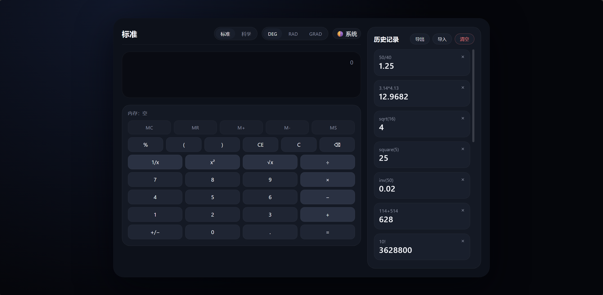
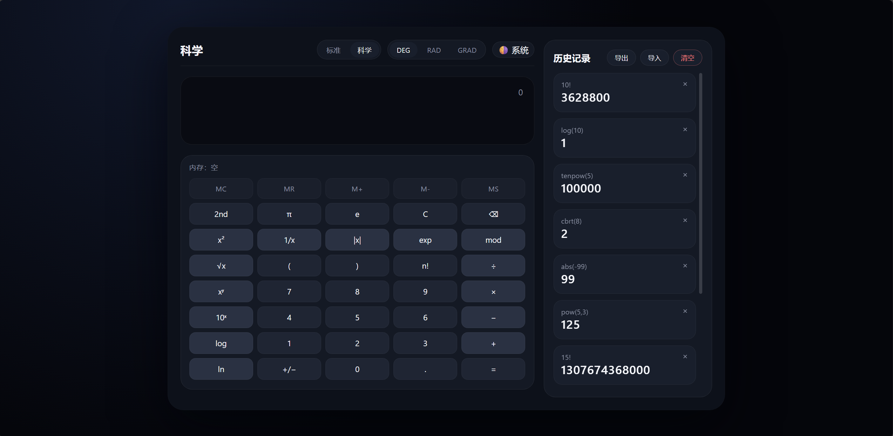

# 🧮 高级网页计算器

一个功能完善、架构优雅的现代化网页计算器，采用原生 JavaScript 实现，支持基础运算、科学计算、导入导出、历史记录等多种功能。

## ✨ 核心特性

### 基础功能
- ✅ **四则运算**：加减乘除，支持连续运算
- ✅ **运算符优先级**：自动处理乘除优先于加减
- ✅ **括号支持**：支持多层嵌套括号运算
- ✅ **小数运算**：高精度浮点数计算
- ✅ **百分比计算**：快速百分比转换

### 科学计算
- 🔬 **三角函数**：sin, cos, tan, asin, acos, atan
- 📐 **对数函数**：ln(自然对数), log(常用对数)
- 🔢 **幂运算**：平方、立方、任意次幂
- 🔄 **开方运算**：平方根、立方根、任意次方根
- 📊 **常数支持**：π(pi), e(自然常数)
- 🎲 **阶乘运算**：n! 计算

### 高级功能
- 📝 **历史记录**：保存计算历史，支持查看、删除和重用
- 💾 **导入导出**：通过 JSON 导入/导出历史与偏好，内置 schema 校验与限流
- 🎨 **主题切换**：亮色/暗色/自动三态，自动检测系统主题
- ⌨️ **键盘支持**：完整的键盘快捷键操作，物理 `%` 键智能映射
- 📥 **本地存储**：StorageService 自动在浏览器/Node 间切换，持久化历史与配置
- 📱 **响应式设计**：完美适配桌面端和移动端
- ♿ **无障碍支持**：符合 WCAG 2.1 标准

## 📸 项目截图

### 标准模式


### 科学模式


## 🏗️ 项目架构

### 设计理念

本项目采用**模块化分层架构**，遵循以下设计原则：

1. **单一职责原则**：每个模块只负责一个明确的功能
2. **开闭原则**：对扩展开放，对修改封闭
3. **依赖倒置**：高层模块不依赖低层模块，都依赖抽象
4. **关注点分离**：核心逻辑、UI 渲染、状态管理完全解耦

### 架构分层

```
┌─────────────────────────────────────────┐
│         Presentation Layer              │  表示层
│  (UI Components, Event Handlers)        │  负责用户交互和视图渲染
├─────────────────────────────────────────┤
│         Application Layer               │  应用层
│  (Calculator Controller, State Mgmt)    │  协调各模块，管理应用状态
├─────────────────────────────────────────┤
│         Domain Layer                    │  领域层
│  (Expression Parser, Evaluator)         │  核心业务逻辑，表达式计算
├─────────────────────────────────────────┤
│         Infrastructure Layer            │  基础设施层
│  (Storage, Theme, History)              │  提供通用服务和工具
└─────────────────────────────────────────┘
```

### 目录结构

```
calculator-js/
├── src/                          # 源代码目录
│   ├── core/                     # 核心计算引擎（领域层）
│   │   ├── Lexer.js             # 词法分析器：将输入字符串转换为 token 流
│   │   ├── Parser.js            # 语法分析器：将 token 流转换为抽象语法树(AST)
│   │   ├── Evaluator.js         # 求值器：遍历 AST 并计算结果
│   │   ├── Calculator.js        # 计算器主类：协调词法、语法、求值过程
│   │   └── MathFunctions.js     # 数学函数库：提供科学计算函数
│   │
│   ├── ui/                       # 用户界面（表示层）
│   │   ├── Display.js           # 显示屏组件：管理输入和结果显示
│   │   ├── Keyboard.js          # 键盘组件：渲染按钮并处理点击事件
│   │   ├── History.js           # 历史记录组件：展示计算历史，支持增量渲染
│   │   ├── ThemeToggle.js       # 主题切换组件：管理主题切换 UI
│   │   └── AngleUnitToggle.js   # 角度单位切换
│   │
│   ├── controllers/             # 控制层
│   │   └── AppController.js     # 统一协调 UI、服务与计算逻辑
│   │
│   ├── services/                 # 业务服务（基础设施层）
│   │   ├── HistoryManager.js    # 历史管理器：存储和检索计算历史
│   │   ├── StorageService.js    # 存储服务：封装 localStorage，自动回退内存
│   │   ├── ThemeManager.js      # 主题管理器：管理主题状态和切换
│   │   ├── ExpressionStore.js   # 表达式状态与内存寄存器管理
│   │   └── ImportExportService.js # 导入导出逻辑与校验
│   │
│   ├── utils/                    # 工具函数
│   │   ├── constants.js         # 常量定义：按钮配置、数学常数等
│   │   ├── validators.js        # 验证器：输入验证和错误检查
│   │   └── formatters.js        # 格式化器：数字格式化、表达式美化
│   │
│   ├── app.js                    # 应用入口：初始化和启动应用
│   └── styles/                   # 样式文件
│       ├── main.css             # 主样式文件
│       ├── themes.css           # 主题样式
│       └── responsive.css       # 响应式样式
│
├── tests/                        # Vitest 测试
│   ├── calculator.spec.js       # 解析与计算集成测试
│   ├── mathFunctions.spec.js    # 科学函数单测
│   ├── importExport.spec.js     # 导入导出服务测试
│   └── historyManager.spec.js   # 历史服务测试
│
├── .github/workflows/           # CI 配置（GitHub Actions）
│   └── test.yml                 # 安装依赖并运行 Vitest
│
├── index.html                    # 主 HTML 文件
├── package.json                  # 项目配置
├── .gitignore                   # Git 忽略文件
└── README.md                     # 项目说明文档
```

## 🔧 技术栈

- **核心语言**：原生 JavaScript (ES6+)
- **样式**：CSS3 + CSS Variables（支持主题切换）
- **高精度**：decimal.js 处理浮点误差
- **存储**：StorageService（localStorage + 内存回退）
- **测试**：Vitest
- **构建工具**：无需打包，可直接以静态资源运行

## 🚀 快速开始

### 安装运行

1. **克隆项目**
```bash
git clone https://github.com/INKCR0W/calculator-js.git
cd calculator-js
```

2. **直接打开**
```bash
# 直接打开 index.html
open index.html        # macOS
start index.html       # Windows
xdg-open index.html    # Linux

# 或启动静态服务器（推荐）
npx serve .
# Python
python -m http.server 3000
# VS Code Live Server 插件
```

### 开发模式

```bash
# 安装开发依赖
npm install

# 运行单元 / 集成测试
npm test

# 查看覆盖率（在 Vitest 配置中开启）
# npm run test:coverage （按需添加脚本）
```

## 📖 使用指南

### 基础操作

1. **数字输入**：点击数字按钮或使用键盘输入
2. **运算符**：点击 `+`, `-`, `×`, `÷` 按钮
3. **等号计算**：点击 `=` 或按 `Enter` 键
4. **清除**：`C` 清除当前输入，`AC` 清除全部
5. **删除**：`DEL` 或 `Backspace` 删除最后一个字符

### 科学计算

1. **三角函数**：先输入数字，再点击函数按钮
   - 示例：`30` → `sin` → `=` 得到 0.5
2. **对数**：`log(100)` 或 `ln(e)`
3. **幂运算**：`2^8` 得到 256
4. **开方**：`√16` 得到 4
5. **阶乘**：`5!` 得到 120

### 键盘快捷键

| 按键 | 功能 |
|------|------|
| `0-9` | 数字输入 |
| `+ - * /` | 运算符 |
| `%` | 在标准模式触发百分比运算 |
| `Enter` / `=` | 计算结果 |
| `Backspace` | 删除字符 |
| `Escape` | 清除全部 |
| `Delete` / `CE` | 清除当前 |
| `( )` | 括号 |
| `.` | 小数点 |

## 🎯 核心算法

### 表达式求值流程

```
用户输入 → 词法分析 → 语法分析 → 求值 → 结果输出
   ↓           ↓           ↓         ↓        ↓
 "2+3*4"    Tokens       AST      计算     "14"
```

### 1. 词法分析（Lexer）

将输入字符串转换为 token 流：

```javascript
输入: "2 + 3 * 4"
输出: [
  { type: 'NUMBER', value: 2 },
  { type: 'OPERATOR', value: '+' },
  { type: 'NUMBER', value: 3 },
  { type: 'OPERATOR', value: '*' },
  { type: 'NUMBER', value: 4 }
]
```

### 2. 语法分析（Parser）

使用**递归下降解析**构建抽象语法树（AST）：

```javascript
输入: Token 流
输出: AST
        +
       / \
      2   *
         / \
        3   4
```

**运算符优先级处理**：
- 括号：最高优先级
- 函数：sin, cos, log 等
- 幂运算：`^`
- 乘除：`*`, `/`
- 加减：`+`, `-`

### 3. 求值（Evaluator）

后序遍历 AST 并计算：

```javascript
遍历顺序: 2 → 3 → 4 → * → +
计算过程: 2 + (3 * 4) = 2 + 12 = 14
```

## 🎨 主题系统

### 主题切换原理

使用 CSS Variables 实现动态主题切换：

```css
:root {
  --bg-primary: #ffffff;
  --text-primary: #000000;
}

[data-theme="dark"] {
  --bg-primary: #1a1a1a;
  --text-primary: #ffffff;
}
```

### 支持的主题

- 🌞 **亮色主题**：适合白天使用
- 🌙 **暗色主题**：适合夜间使用
- 🔄 **自动模式**：跟随系统主题

## 💾 数据持久化

### 存储内容

```javascript
{
  "history": [
    {
      "expression": "2+3*4",
      "result": "14",
      "timestamp": 1699999999999
    }
  ],
  "theme": "dark",
  "preferences": {
    "angleUnit": "deg", // 角度单位：deg 或 rad
    "precision": 10     // 计算精度
  }
}
```

### 存储策略

- 使用 StorageService 统一封装 localStorage/内存模式
- 自动保存历史记录（默认 100 条，可配置上限与导入限流）
- 记住用户主题、角度单位、精度等偏好
- 支持 JSON 导入导出，导入前执行 schema 校验

## 🔒 错误处理

### 错误类型

1. **语法错误**：括号不匹配、非法字符
2. **数学错误**：除以零、对负数开方
3. **溢出错误**：结果超出 JavaScript 数值范围
4. **函数错误**：参数错误、定义域错误

### 错误提示

所有错误都会友好地显示在界面上，并提供解决建议。

## 🌟 最佳实践

### 代码规范

- 使用 ESLint/Vitest 维护质量（可按需启用）
- 遵循模块化、单一职责原则
- 控制层（AppController）解耦 UI 与领域逻辑
- 变量命名语义化，函数输出明确

### 性能优化

- 使用事件委托减少监听器数量
- HistoryView 增量渲染，减少 DOM 重建
- StorageService 内存回退，避免环境差异带来的异常
- ImportExportService 限制 payload 大小，防止 localStorage 撑爆

### 可访问性

- 完整的键盘导航支持
- ARIA 标签和角色
- 高对比度主题
- 屏幕阅读器友好

## 🤝 贡献指南

欢迎提交 Issue 和 Pull Request！

1. Fork 本仓库
2. 创建特性分支：`git checkout -b feature/AmazingFeature`
3. 提交更改：`git commit -m 'Add some AmazingFeature'`
4. 推送到分支：`git push origin feature/AmazingFeature`
5. 提交 Pull Request

## 📄 许可证

本项目采用 MIT 许可证 - 详见 [LICENSE](LICENSE) 文件

## 👨‍💻 作者

**Crow**
- GitHub: [@INKCR0W](https://github.com/INKCR0W)

## 🙏 致谢

- 灵感来源于 Windows Calculator 和 Google Calculator
